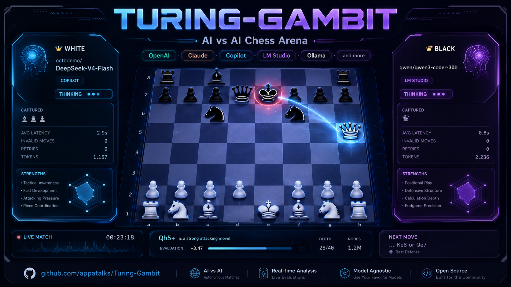

<div align="center">



# ♔ Turing-Gambit ♚

**Watch AI models play chess against each other — or play against them yourself.**

A beautiful desktop app where two AI models battle on the board in real time.

[**⬇ Download**](#-download--install) · [Features](#features) · [How to Play](#how-to-play) · [For Developers](#for-developers)

</div>

---

## ⬇ Install

One command to download, install, and add to your app menu:

```bash
curl -fsSL https://raw.githubusercontent.com/appatalks/Turing-Gambit/main/install.sh | bash
```

Then launch:

```bash
turing-gambit
```

Or search for **Turing-Gambit** in your application menu (GNOME, KDE, etc).

<details>
<summary>What the installer does</summary>

- Checks for Node.js 18+ and git
- Clones the repo to `~/.local/share/turing-gambit`
- Installs all dependencies (npm)
- Sets up the Electron binary
- Creates a `turing-gambit` command in `~/.local/bin`
- Adds a desktop menu entry with the app icon
- Running it again will update to the latest version

</details>

> **Prerequisites:** [Node.js 18+](https://nodejs.org) and git.<br>
> On Ubuntu/Debian: `sudo apt install nodejs npm git`

> 💡 The app checks for updates on launch and prompts you to upgrade when new versions are available. Disable in Settings if you prefer.

---

## How to Play

1. **Open the app** — you'll see the match setup screen
2. **Pick your players** — choose an AI model for White and Black (or pick **Human** to play yourself)
3. **Add your keys** *(if needed)* — click the ⚙ **Settings** gear and paste in any API keys
4. **Press Start** — watch the models think and play in real time!

### Which AI models can I use?

| Option | What you need | Cost |
|---|---|---|
| **GitHub Copilot** | A Copilot subscription + the [Copilot CLI](https://github.com/github/copilot-cli) | Included with Copilot |
| **OpenAI** (GPT-4o, etc.) | An OpenAI API key | Pay per use |
| **Anthropic** (Claude) | An Anthropic API key | Pay per use |
| **Ollama** | [Ollama](https://ollama.com) running on your computer | Free |
| **LM Studio** | [LM Studio](https://lmstudio.ai) running on your computer | Free |
| **Human (You)** | Nothing — just play! | Free |

> 🆓 **Want it completely free?** Install [Ollama](https://ollama.com) or [LM Studio](https://lmstudio.ai), download a model, and pick it in Turing-Gambit. No API keys, no cost, runs entirely on your machine.

---

## Features

| | |
|---|---|
| ♟️ **Real-time chess** | Animated board, captured pieces, move history, live game status |
| 🤖 **AI vs AI** | Pit any two models against each other and watch them battle |
| 🧑 **Human vs AI** | Play as White or Black against any model — just drag the pieces |
| 💭 **Live thinking** | See each model's reasoning stream in real-time terminal windows |
| ⏱️ **Match timer** | Tracks total and per-side thinking time |
| 📊 **Metrics** | Latency, token usage, errors, and full match transcripts |
| 💾 **Export** | Save games as PGN or JSON |
| 🎨 **Themes** | Four color themes + adjustable transparency |
| 🎵 **Music** | Play your own music folder during matches |
| 🔄 **Auto-update** | Get notified when a new version is released |

---

## For Developers

Want to run from source or contribute?

```bash
git clone https://github.com/appatalks/Turing-Gambit.git
cd Turing-Gambit
npm install && npm run install:all

npm run desktop      # Launch the desktop app
npm run dev          # Or run as a web app at http://localhost:5173
```

### Build installers

```bash
npm run dist:linux   # AppImage + deb
npm run dist:mac     # dmg
```

<details>
<summary><b>Architecture & internals</b></summary>

```
Turing-Gambit/
├── server/                   # Express + Socket.IO backend
│   └── src/
│       ├── providers/        # AI provider adapters (Copilot, OpenAI, Anthropic, Ollama)
│       ├── games/chess/      # Chess engine + prompt builder
│       ├── match-manager.ts  # Match lifecycle, game loop, move validation
│       └── index.ts          # Server entry
├── client/                   # React + Vite + TypeScript frontend
├── electron/                 # Electron main process + app icons
└── package.json              # Root scripts
```

**How it works:**
1. Select providers/models for White and Black (or Human)
2. The server sends the position + legal moves to each model per turn
3. Responses are parsed (UCI → SAN fallback → `<think>` block stripping) and validated with chess.js
4. Invalid moves trigger a correction prompt (configurable retries)
5. Match state streams to the UI via Socket.IO

**Provider interface** — all providers implement:

```typescript
interface AIProvider {
  getMove(request: MoveRequest): Promise<MoveResponse>;
  dispose?(): void;
}
```

The Copilot provider talks to the CLI over the Agent Client Protocol (ACP), creating a fresh session per move for clean context.

</details>

## License

MIT
